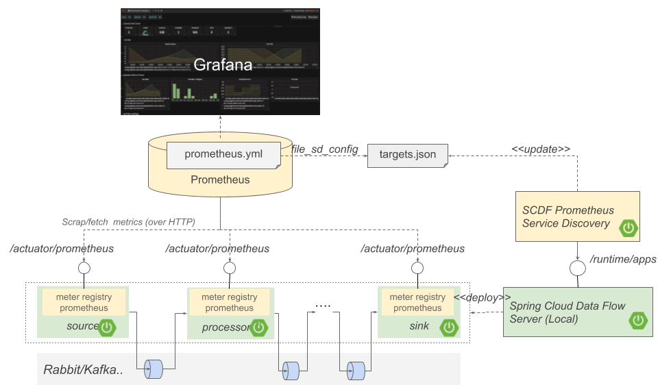
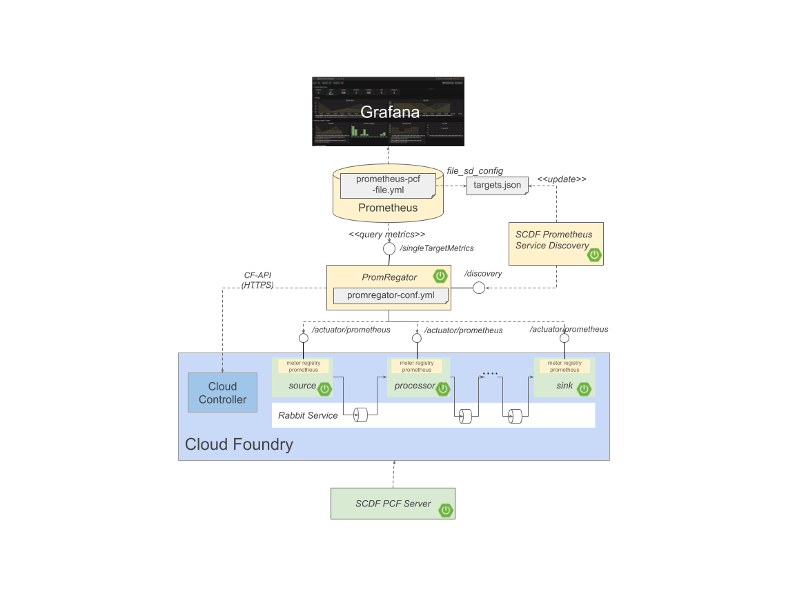

# Spring Cloud Data Flow - Prometheus Service Discovery (for Dev/Test only)

> NOTE: This tool should be used only for test/demo purposes! Don't use it in production!

Sample service that uses the SCDF's runtime applications metadata to discover SpringBoot applications to be monitored with Prometheus. 

Prometheus Service Discovery for SCSt apps deployed with the Local Deployer. 
It is build on top of the [file_sd_config](https://prometheus.io/docs/prometheus/latest/configuration/configuration/#file_sd_config) mechanism.
The `file_sd_config` file format looks like this:
 
```json
 [
   {
     "targets": [ "<host>:<ip>", ... ],
     "labels": {
       "<labelname>": "<labelvalue>", ...
     }
   },
   ...
 ]
```
The `targets` field hods the list of the applications to be scraped by Prometheus. 


## Local Mode 

Following Spring Cloud Data Flow diagram illustrates how the `service-discovery` is used in a `local` SCDF deployment to provide `Prometheus` with the target urls to scrap.
When in `metrics.prometheus.target.mode=local` mode the `service-discovery`, uses the [runtime/apps](http://docs.spring.io/spring-cloud-dataflow/docs/2.0.1.RELEASE/reference/htmlsingle/#api-guide-resources-runtime-information-applications-listing-all) 
SCDF REST API To retrieve information about all instances of all apps currently deployed. 
From each instance it retrieves the value of the `metrics.prometheus.target.attributeName` (default value: `url`), strips the protocol prefix and adds it to the target URL list. 
The `metrics.prometheus.target.filePath` property specifies the path and the name of the `file_sd_config` file shared with `Prometheus`.

> When used inside docker-compose the `service-discovery` has to set the `metrics.prometheus.target.overrideIp` property to the IP of the `skipper` container (or the local host).   




```bash
java -jar spring-cloud-dataflow-prometheus-service-discovery.jar \
   --metrics.prometheus.target.discoveryUrl=http://<DATAFLOW IP>:9393/runtime/apps \
   --metrics.prometheus.target.filePath=/tmp/scdf-targets/targets.json \
   --metrics.prometheus.target.cron=0/30 * * * * * \
   --metrics.prometheus.target.mode=local \
   --metrics.prometheus.target.overrideIp=<SKIPPER IP>
```

When run on the local host, both the `DATAFLOW IP` and the `SKIPPER IP` can point to `127.0.0.1`.
But when run inside a docker-compose the `DATAFLOW IP`should be substituted by the datafalow container name  (for example `dataflow-server`) 
`SKIPPER IP` by the skipper container name (e.g. something like `skipper-server`). The 127.0.0.1 would not work in docker-compose settings!

## PromRegator Mode

The [SCDF Prometheus monitoring on Cloud Foundry](https://docs.google.com/document/d/1XGwjn1wUW843q8G8SEsZYuMRuBIKhsufH0yUEaLMbPc/edit?usp=sharing) requires the Pomregator service. 
In this use-case the `service-disovery` retrieves the targets urls from `PromRegator` instead of SCDF's `runtime/apps` 



```bash
java -jar spring-cloud-dataflow-prometheus-service-discovery.jar \
  --metrics.prometheus.target.discoveryUrl=http://localhost:8080/discovery \
  --metrics.prometheus.target.filePath=/tmp/targets.json \
  --metrics.prometheus.target.cron=0/30 * * * * * \
  --metrics.prometheus.target.mode=promregator \
  --server.port=9091
```


### Build
* Build `spring-cloud-dataflow-prometheus-service-discovery.jar` 
```bash
./mvnw clean install
```

* Publish the `springcloud/spring-cloud-dataflow-prometheus-service-discovery` image to `DockerHub`

```bash
./mvnw clean install docker:build -Pspring
./mvnw -Ddocker.username=xxx -Ddocker.password=xxx clean install docker:push -Pspring
```
